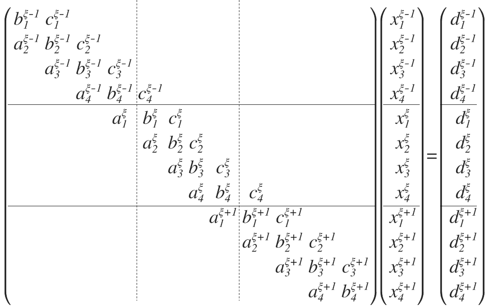
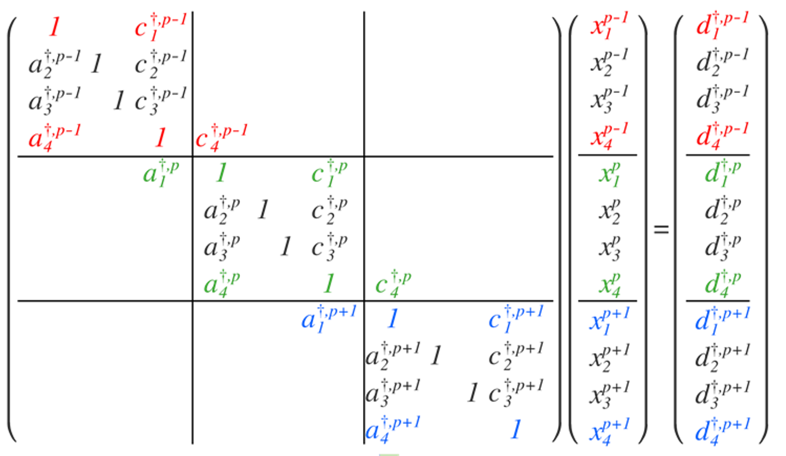
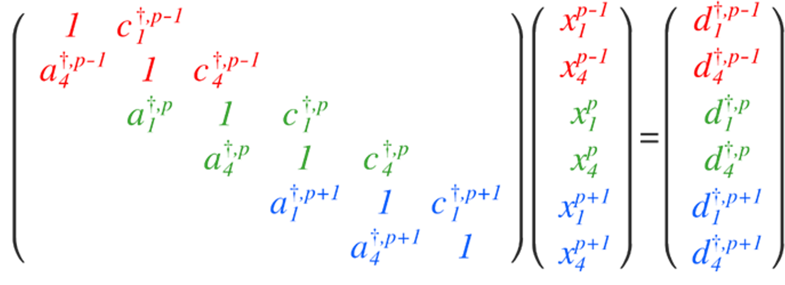
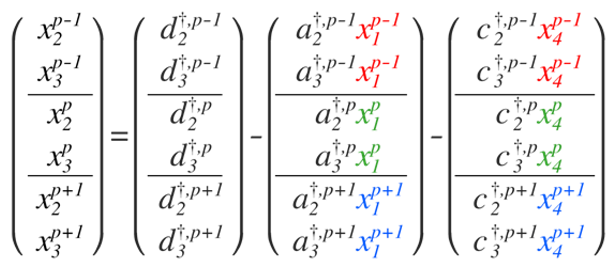

Theory                          {#theory_page}
======

[TOC]
# Thomas algorithm

 The Thomas algorithm is the best-known sequential tridiagonal matrix algorhtm (TDMA) that is commonly used to obtain the solution of a tridiagonal system. It is a special form of the Gaussian elimination algorithm for the diaonally dominant or symmetric positive definite (SPD) tridiagonal matrix. This algorithm has the ideal compuational complexity, $O(N)$. It greatly reduced to $O(N)$ instead of $O(N^3)$ for the Gauss elimination.
 
 However, the Thomas algorithm for a tridiagonal system cannot be made parallel due to its sequential process during both elimination and substitution.

$$
\begin{pmatrix}
b_0 & c_0 & 0 & 0 & 0 & \cdots &0 \\\
a_1 & b_1 & c_1 & 0 & 0 & \cdots &0 \\\
0 & a_2 & b_2 & c_2 & 0 &  \cdots &0 \\\
0 & 0 & a_3 & b_3 & c_3 &   \cdots &0 \\\
\vdots & \vdots & \vdots & \vdots & \vdots & \ddots & \vdots \\\
0 & 0 & 0 & 0 & 0 & \cdots & c_{n-1} \\\
0 & 0 & 0 & 0 & 0 & \cdots & b_n
\end{pmatrix}   \begin{pmatrix}
x_0 \\\ x_1 \\\ x_2 \\\ x_3 \\\ \vdots \\\ x_{n-2} \\\ x_{n-1}
\end{pmatrix}   \begin{pmatrix}
d_0 \\\ d_1 \\\ d_2 \\\ d_3 \\\ \vdots \\\ d_{n-2} \\\ d_{n-1}
\end{pmatrix},
$$

the Gaussian elimination procedure can be simplified as follows:

1. Forward elimination
   
   $$
   c'_i = 
   \begin{cases}
    \frac{c_i}{b_i}, & i=0\\
    \frac{c_i}{b_i-a_i c' _{i-1}}, & i=1, 2, \cdots, n-2\\
   \end{cases}
   $$
   $$
   d'_i = 
      \begin{cases}
      \frac{d_i}{b_i}, & i=0\\
      \frac{d_i - a_i d'_{i-1}}{b_i-a_i c' _{i-1}}, & i=1, 2, \cdots, n-1\\
      \end{cases}
   $$

2. Backward elimination
   
   <!-- $$
   x_{n-1} &= d' _{n-1}, \\\
   x_i &= d' _i - c' _i x_{i+1}, \quad i = n-2, n-3, \cdots, 1, 0
   $$ -->
   $$
   \begin{aligned}
   x_{n-1} &= {d}'_{n-1}, \\\
   x_{i} &= {d}'_{i} - c'_{i}x_{i+1}, \quad i = n-2, n-3, \cdots, 1, 0
   \end{aligned}
   $$

# Modified Thomas algorithm

<!-- ref 1의 내용. 행렬 batch 해서 N자 형태로 만들어서 계산하는 방법론까지 
e-mail 사진이랑, PPT참고, 알록달록 행렬 이미지? latex추가 -->
*I will revise below section..*

The divide-and-conquer method [[1]](#reference) is used to solve partitioned tridiagonal systems of equations in the distributed memory system.

Divide-and-conquer methods
- Large tridiagonal system is transformed into a reduced tridiagonal system through partial reduction in each partitioned sub-matrix, which are divided in computing cores. 

- The soultion is the obtained by solving the reduced tridiagonal system and updating the remaining unknowns in the partitioned sub-matrices.

### Hybrid Thomas-PCR
- Transforming the partitioned sub-matrices in the tridiagonal systems into modified sub-matrices 
- Constructing reduced tridiagonal systems from the modified sub-matrices
- Solving the reduced tridiagonal systems
- Distributing the solution of reduced tridiagonal system
- Updating the other unknowns
  
* Each computing core transforms the partitioned sub-matrices in the tridiagonal systems of equations into the modified forms by applying the modified Thomas algorithm.

$$
\begin{pmatrix}
b^{\xi-1}_1 & c^{\xi-1}_1 &  &  &  &  &  &  &  &  &  & \\\ 
a^{\xi-1}_2 & b^{\xi-1}_2 & c^{\xi-1}_2 &  &  &  &  &  &  &  &  & \\\ 
 & a^{\xi-1}_3 & b^{\xi-1}_3 & c^{\xi-1}_3 &  &  &  &  &  &  &  & \\\ 
 &  & a^{\xi-1}_4 & b^{\xi-1}_4 & c^{\xi-1}_4 &  &  &  &  &  &  & \\\ 
 &  &  & a^{\xi}_1 & b^{\xi}_1 & c^{\xi}_1 &  &  &  &  &  & \\\ 
 &  &  &  & a^{\xi}_2 & b^{\xi}_2 & c^{\xi}_2 &  &  &  &  & \\\ 
 &  &  &  &  & a^{\xi}_3 & b^{\xi}_3 & c^{\xi}_3 &  &  &  & \\\ 
 &  &  &  &  &  & a^{\xi}_4 & b^{\xi}_4 & c^{\xi}_4 &  &  &\\\ 
 &  &  &  &  &  &  & a^{\xi+1}_1 & b^{\xi+1}_1 & c^{\xi+1}_1 &  &\\\ 
 &  &  &  &  &  &  &  & a^{\xi+1}_2 & b^{\xi+1}_2 & c^{\xi+1}_2 &\\\ 
 &  &  &  &  &  &  &  &  & a^{\xi+1}_3 & b^{\xi+1}_3 & c^{\xi+1}_3\\\ 
 &  &  &  &  &  &  &  &  &  & a^{\xi+1}_4 & b^{\xi+1}_4
\end{pmatrix} \begin{pmatrix}
x^{\xi-1}_1\\\ 
x^{\xi-1}_2\\\ 
x^{\xi-1}_3\\\ 
x^{\xi-1}_4\\\ 
x^{\xi}_1\\\ 
x^{\xi}_2\\\ 
x^{\xi}_3\\\ 
x^{\xi}_4\\\ 
x^{\xi+1}_1\\\ 
x^{\xi+1}_2\\\ 
x^{\xi+1}_3\\\
x^{\xi+1}_4 
\end{pmatrix} = 
\begin{pmatrix}
d^{\xi-1}_1\\\ 
d^{\xi-1}_2\\\ 
d^{\xi-1}_3\\\ 
d^{\xi-1}_4\\\ 
d^{\xi}_1\\\ 
d^{\xi}_2\\\ 
d^{\xi}_3\\\ 
d^{\xi}_4\\\ 
d^{\xi+1}_1\\\ 
d^{\xi+1}_2\\\ 
d^{\xi+1}_3\\\
d^{\xi+1}_4 
\end{pmatrix}
$$

# All-to-all communication
*I will revise below section..*

Reduced all-to-all communication

- The newly designed communication scheme based on MPI Alltoallw acclerates to collect the rows and construct the reduced tridiagonal systems.

The main algorithm for a tridiagonal matrix consists of the following five steps: 

- (1) Transform the partitioned submatrices in the tridiagonal systems into modified submatrices:
        Each computing core transforms the partitioned submatrices in the tridiagonal systems of equations into the modified forms by applying modified Thomas algorithm.
- (2) Construct reduced tridiagonal systems from the modified submatrices:
        The reduced tridiagonal systems are constructed by collecting the first and last rows of the modified submatrices from each core using MPI_Ialltoallw.
- (3) Solve the reduced tridiagonal systems:
        The reduced tridiagonal systems constructed in Step 2 are solved by applying the Thomas algorithm.
- (4) Distribute the solutions of the reduced tridiagonal systems:
        The solutions of the reduced tridiagonal systems in Step 3 are distributed to each core using MPI_Ialltoallw.
        This communication is an exact inverse of the communication in Step 2.
- (5) Update the other unknowns in the modified tridiagonal systems:
        The remaining unknowns in the modified submatrices in Step 1 are solved in each computing core with the solutions obtained in Step 3 and Step 4.
<!-- 
연구 contribution. 위 내용을 all2all communication이용해서 병렬로, 많은 연산 빠르게 할 수 있다는 내용. paper, PPT참고, 그 데이터 쌓인 3d figure 같이 첨부 -->

## Reference
<!-- [1] [J. Kim, P. Moin, J. Comput. Phys. 59 (2) (1985) 308–323.](https://www.sciencedirect.com/science/article/abs/pii/0021999185901482) -->
[[1] Laszlo, E., Giles, M., & Appleyard, J. (2016). Manycore algorithms for batch scalar and block tridiagonal solvers. ACM Transactions on Mathematical Software (TOMS), 42(4), 1-36.](https://www.sciencedirect.com/science/article/abs/pii/0021999185901482) 

| Previous          |                              Next |
|:------------------|----------------------------------:|
| [Performance](perf_page.html) | [Links](link_page.html) |

